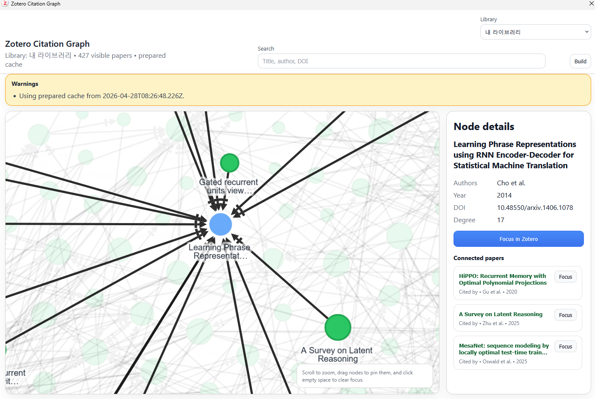
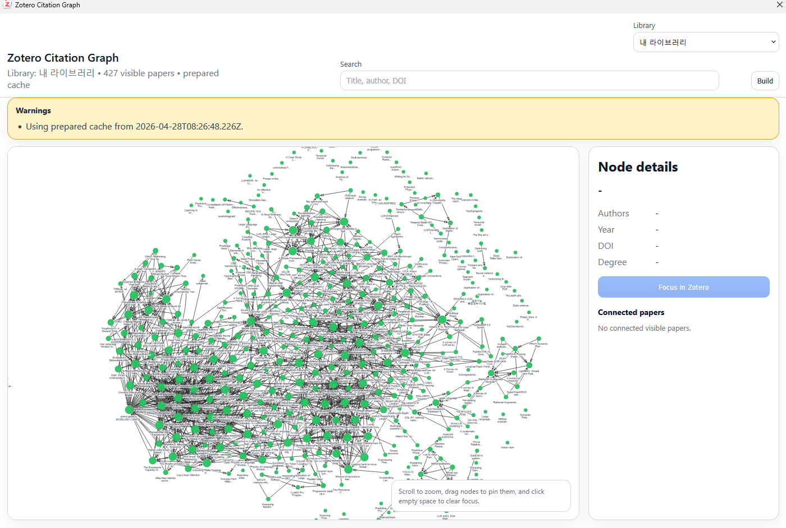

# Zotero Citation Graph

Interactive Zotero plugin for visualizing citation relationships between papers in the current Zotero library, collection, or visible item list.

The plugin adds Zotero menu and toolbar entry points, builds a local citation graph from Zotero metadata and indexed attachment text, caches the graph for faster reuse, and opens the graph inside the Zotero main window as a closeable embedded view.





## Features

- Adds direct menubar buttons for **Build Citation Graph Cache** and **Open Citation Graph**
- Adds toolbar buttons for **Build Graph Cache** and **Open Graph** when Zotero exposes a compatible toolbar
- Adds **Tools -> Build Citation Graph Cache**, **Tools -> Citation Graph Cache Status**, and **Tools -> Open Citation Graph**
- Adds **Show Graph** to the Zotero item context menu
- Opens the graph inside Zotero as an embedded overlay without using Zotero reader tabs
- Uses a compact graph-toolbar close icon and floating warning toasts so the graph has more room
- Lets you rebuild the graph directly from the graph window with **Build**
- Lets you focus a selected graph node back in Zotero
- Builds citation edges from Zotero relations, DOI references in `Extra`, DOI references in child notes, indexed attachment text, and normalized title matches

## Download

- Direct download: [Google Drive](https://drive.google.com/file/d/1_NLCpcj_n1pId5F3Pmitx3RHLKc7Ls2H/view?usp=drive_link)

## Beginner Start

This section is for developers who are new to Zotero plugin development.

### What You Are Building

A Zotero plugin is packaged as an `.xpi` file. Internally, it is a zipped extension bundle containing manifest files, JavaScript, XHTML, CSS, and assets. Zotero loads the plugin, calls lifecycle hooks such as startup and shutdown, and lets the plugin add UI to the Zotero main window.

This project uses `zotero-plugin-scaffold`, so most packaging details are handled by `npm run build`.

### Requirements

- Zotero 7 or a compatible modern Zotero build
- Node.js and npm
- Git
- A terminal such as PowerShell on Windows

Install dependencies once:

```powershell
npm install
```

Build the plugin:

```powershell
npm run build
```

The built plugin is written to:

```text
.scaffold\build\zotero-citation-graph.xpi
```

### Install The Built XPI For Manual Testing

For quick testing in Zotero:

1. Run `npm run build`
2. Open Zotero
3. Open **Tools -> Add-ons**
4. Use the add-ons menu to install an add-on from file
5. Choose `.scaffold\build\zotero-citation-graph.xpi`
6. Restart Zotero if Zotero asks you to

### Development Install With An Extension Proxy

For repeated development, a proxy install is easier than reinstalling the XPI after every build.

1. Run `npm run build`
2. Find your Zotero profile directory
3. Open or create the profile's `extensions` directory
4. Create a plain text file named exactly:

```text
citation-graph@example.com
```

5. Put this absolute path inside that file:

```text
<repo-root>\.scaffold\build
```

6. Restart Zotero

After that, rebuild with `npm run build` and restart Zotero when you want Zotero to reload changed plugin files.

On Windows, Zotero profiles are commonly under:

```text
%APPDATA%\Zotero\Zotero\Profiles\
```

## Project Structure

```text
.
|-- addon/                         # Static files copied into the built Zotero extension
|   |-- bootstrap.js                # Scaffold bootstrap template
|   |-- manifest.json               # Manifest template with scaffold placeholders
|   |-- prefs.js                    # Plugin preference defaults
|   `-- content/
|       |-- cache/
|       |   |-- cache.xhtml         # Cache status window markup
|       |   `-- cache.css           # Cache status window styles
|       `-- graph/
|           |-- graph.xhtml         # Graph view markup loaded by Zotero
|           |-- graph.html          # Browser-friendly mirror of the graph markup
|           `-- graph.css           # Graph view layout and visual styles
|-- assets/                        # README screenshots
|-- scripts/
|   `-- build.mjs                   # Legacy custom build helper; current build uses npm run build
|-- src/
|   |-- index.js                    # Scaffold entry point; creates Zotero.CitationGraph
|   |-- scaffold-addon.js           # Thin helper class used by the scaffold entry
|   |-- scaffold-hooks.js           # Zotero lifecycle hooks called by the scaffold
|   |-- plugin-core.js              # Main Zotero integration, cache, graph-building, and embedded panel logic
|   |-- graph-entry.js              # Bundled runtime for the interactive graph view
|   |-- cache-entry.js              # Bundled runtime for the cache status window
|   |-- prefs.js                    # Source-side preference defaults
|   |-- manifest.json               # Legacy manifest source
|   |-- install.rdf                 # Legacy install metadata
|   |-- graph/                      # Older standalone graph build path; not used by npm run build
|   |-- citation-graph-plugin.js    # Older plugin implementation kept as reference
|   `-- bootstrap.js                # Older bootstrap source
|-- typings/                       # Local generated Zotero type definitions
|-- package.json                   # npm metadata, dependencies, and scripts
|-- package-lock.json              # Locked dependency versions
`-- zotero-plugin.config.ts        # Active scaffold build configuration
```

## Active Build Flow

The active build is configured in `zotero-plugin.config.ts`.

`npm run build` does four important things:

1. Copies static files from `addon/**/*.*` into `.scaffold/build`
2. Bundles `src/index.js` into `addon/content/scripts/citationgraph.js`
3. Bundles `src/graph-entry.js` and `src/cache-entry.js` into graph/cache browser scripts
4. Packs `.scaffold\build\zotero-citation-graph.xpi`

If a change is not appearing in Zotero, first confirm that it is in one of the active source paths above.

## Runtime Architecture

### Lifecycle

Zotero loads the scaffold bundle and calls the hooks in `src/scaffold-hooks.js`.

- `onStartup()` initializes `CitationGraphPlugin`, exposes `Zotero.CitationGraph.api`, and injects UI into open Zotero windows
- `onMainWindowLoad(win)` injects menu and toolbar UI when a Zotero main window opens
- `onMainWindowUnload(win)` removes injected UI from that window
- `onShutdown()` removes all plugin UI and deletes the global plugin object

### Zotero UI Integration

Most Zotero-facing UI is in `src/plugin-core.js`.

Important areas:

- `addToolsMenuItems()` adds entries under Zotero **Tools**
- `addMenubarButtons()` adds the direct top menubar buttons
- `addToolbarButtons()` adds toolbar buttons when Zotero exposes a compatible toolbar
- `registerLibraryItemMenu()` adds **Show Graph** to the item context menu
- `ensureEmbeddedGraphPanel()` creates the in-Zotero graph iframe overlay
- `closeGraphView()` removes the embedded graph view

The plugin intentionally does not use `Zotero_Tabs` for the graph view. Earlier experiments with native tabs interfered with Zotero PDF reading, so the current safe design is a closeable embedded overlay.

### Graph Data Pipeline

The graph-building logic lives mostly in `src/plugin-core.js`.

Typical flow:

1. User clicks **Build Citation Graph Cache** or **Open Citation Graph**
2. `resolveCurrentScope()` reads the current Zotero library, collection, or visible item list
3. `buildGraph()` creates nodes and citation edges
4. `makePayload()` packages graph data, scope metadata, and warnings
5. `writeCache()` stores a prepared cache in Zotero preferences
6. `showEmbeddedGraph()` opens the embedded iframe and sends the graph payload to it

Cache preference keys:

```text
extensions.zotero.citationgraph.cache.current
extensions.zotero.citationgraph.graphWindow.current
```

### Graph View

The graph iframe uses:

- `addon/content/graph/graph.xhtml` for markup
- `addon/content/graph/graph.css` for layout and styles
- `src/graph-entry.js` for runtime behavior

`src/graph-entry.js` uses Cytoscape for graph rendering and `d3-force` for force simulation behavior.

Key responsibilities:

- Load graph payload from the host Zotero window or preferences
- Render Cytoscape nodes and edges
- Search and highlight matching papers
- Show node details and connected papers
- Focus selected items back in Zotero
- Show warning toasts
- Close the embedded graph view through `Zotero.CitationGraph.api.closeGraphView()`

### Cache Status Window

The cache status UI uses:

- `addon/content/cache/cache.xhtml`
- `addon/content/cache/cache.css`
- `src/cache-entry.js`

It lets a user inspect cache status, rebuild cache, clear cache, refresh status, and open the graph.

## Common Development Tasks

### Change Menu Or Toolbar Buttons

Edit `src/plugin-core.js`.

Useful functions:

- `addToolsMenuItems()`
- `addMenubarButtons()`
- `createMenubarButton()`
- `getToolbarTarget()`
- `addToolbarButtons()`

After changing these, run:

```powershell
npm run build
```

Then restart Zotero.

### Change The Graph Layout Or Controls

Edit:

- `addon/content/graph/graph.xhtml` for structure
- `addon/content/graph/graph.css` for layout and appearance
- `src/graph-entry.js` for behavior

Examples:

- Move or restyle the close button in `graph.xhtml` and `graph.css`
- Change warning toast timing in `renderWarnings()` in `src/graph-entry.js`
- Adjust graph fit, selection, or force layout behavior in `src/graph-entry.js`

### Change Citation Edge Detection

Edit `buildGraph()` and its helper functions in `src/plugin-core.js`.

Relevant helpers:

- `normalizeDOI()`
- `extractDOIs()`
- `extractReferenceDOIs()`
- `getRelationEntries()`
- `resolveRelationTarget()`
- `getChildNotesText()`
- `readAttachmentFullText()`
- `extractReferenceSection()`
- `findTitleMatches()`

Be conservative here. Graph building can touch many Zotero items and attachment indexes, so test with small and large libraries.

### Change Cache Behavior

Edit cache-related functions in `src/plugin-core.js`.

Useful functions:

- `readCache()`
- `writeCache()`
- `clearCache()`
- `isCacheCurrent()`
- `shouldUseCacheFallback()`
- `buildCurrentCache()`
- `loadGraphPayload()`
- `getCacheStatus()`

### Change The Cache Status Window

Edit:

- `addon/content/cache/cache.xhtml`
- `addon/content/cache/cache.css`
- `src/cache-entry.js`

## Verification Checklist

Before sharing a changed build, run:

```powershell
node --check src\plugin-core.js
node --check src\graph-entry.js
node --check src\cache-entry.js
git diff --check
npm run build
```

Then test in Zotero:

1. Zotero starts without plugin errors
2. **Build Citation Graph Cache** works from the menubar
3. **Open Citation Graph** opens the embedded graph
4. The graph close icon closes the embedded view
5. Warnings can be dismissed and auto-hide
6. Selecting a graph node updates node details
7. **Focus in Zotero** selects the matching Zotero item
8. Opening PDFs in Zotero still works

## Debugging Tips

- Use Zotero's debug output to look for messages beginning with `Citation Graph:`
- If the graph iframe is blank, rebuild and confirm `.scaffold/build/addon/content/scripts/citationgraph-graph.js` exists
- If UI buttons do not appear, inspect `addToWindow()`, `addMenubarButtons()`, and `getToolbarTarget()`
- If graph data is stale, clear or rebuild the cache from the cache status window
- If a graph opens with warnings, read the warning toast first; it often explains an empty scope or cache fallback
- If a change appears in source but not Zotero, restart Zotero after rebuilding

## Git And Rollback

Use a feature branch for experiments:

```powershell
git switch -c codex/my-feature
```

Commit working checkpoints:

```powershell
git add README.md src addon
git commit -m "Describe the change"
```

To inspect recent checkpoints:

```powershell
git log --oneline -5
```

Avoid destructive commands such as `git reset --hard` unless you are certain you do not need local changes. This repository may contain local generated files or developer edits that should not be discarded accidentally.

## Release Artifact

The normal build output is:

```text
.scaffold\build\zotero-citation-graph.xpi
```

If you want a versioned copy for a release:

```powershell
New-Item -ItemType Directory -Force release
Copy-Item .scaffold\build\zotero-citation-graph.xpi release\zotero-citation-graph-0.4.2.xpi
```

## Notes For Future Maintainers

- Keep `README.md` updated when the active build paths change
- Prefer editing active scaffold files under `addon/` and `src/*-entry.js`
- Treat `src/graph/*`, `src/citation-graph-plugin.js`, and `scripts/build.mjs` as legacy/reference unless you intentionally revive that build path
- Keep the graph embedded overlay independent from Zotero reader tabs
- This plugin stays offline and does not call external scholarly APIs
- Large scopes are capped by `maxVisibleItems` in `src/plugin-core.js` to keep the graph responsive
