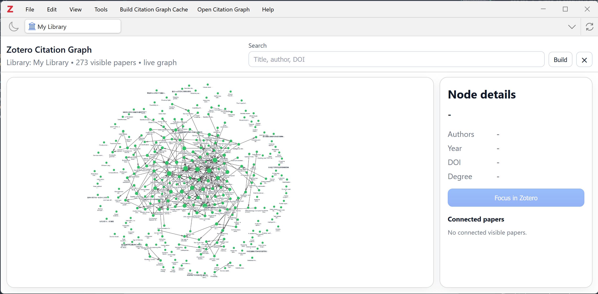

# Zotero Citation Graph

## Introduction

This plugin is a modified version of Thrillcrazyer's one (https://github.com/Thrillcrazyer/Zotero-Citation-Graph), while the modifications are done with Codex.

Interactive Zotero plugin for visualizing citation relationships between papers in the current Zotero library, collection, or visible item list.

The plugin adds Zotero menu and toolbar entry points, builds a local citation graph from Zotero metadata and indexed attachment text, caches the graph for faster reuse, and opens the graph inside the Zotero main window as a closeable embedded view.

## Quick Start

1. Download from the `.xpi` file from the  `Release` section, then add it to your Zotero plugin;
2. After inserting it, click on the newly-added button "Build Citation Graph Cache" on the top menu bar of Zotero, and wait for the completion popup;
3. click the "Open Citation Graph", then you will be able to see the citation graph page.
   

## Source

This plugin is a modified version of Thrillcrazyer's one (https://github.com/Thrillcrazyer/Zotero-Citation-Graph). The main differences are:

1. The original popup view panel is embedded to the Zotero main window.
2. The 2 frequently-used buttons are added to the top of main top menu bar of Zotero
3. The panel layout is optimized a little bit for a larger graph view region.

## Build

```
npm install
npm run install
```

And the `.xpi` plugin file will be located under the `.scaffold\build`.
